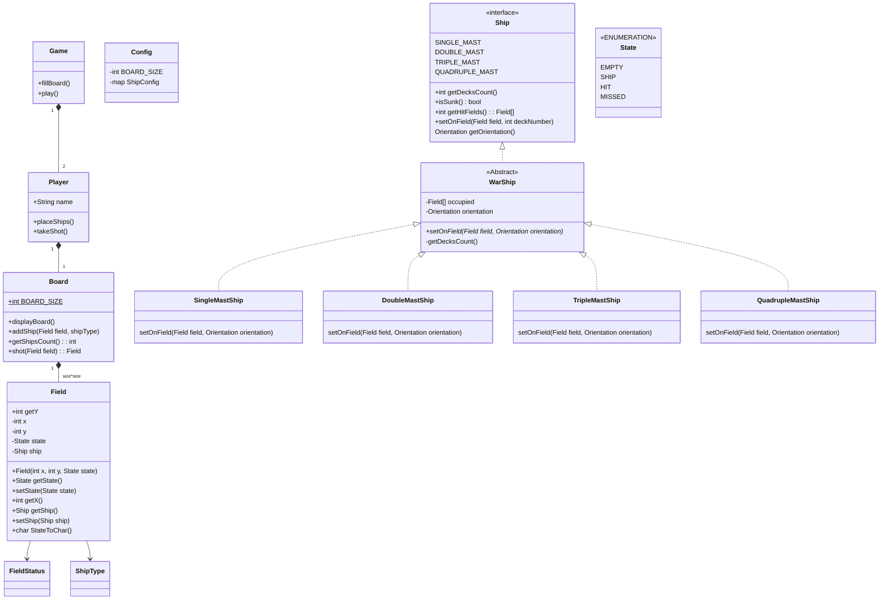

1. getHitFields() : Field[] - zabezpieczyc sie aby nie dało sie manipulowac zwroconymi Field, 
    dane ktore zwracamy w np API maja byc niezmienialne (immutable spr: w Collection List i kopie) 
2. Ship.hit() - zwieksza ilos w hits++ oraz sprawdza czy isSunk() - jesli tak to zmienia state na SUNK   
3. Ship.isSunk() - zwraca true jesli hits == decksCount
4. Board.shot()
5. setOnField() - ustawia statek 1 pole statku - implementacja dla kazdego statku inna
6. fillBoard() - ustawia statki na planszy - setup
7. Map <class SHIP, int> Config - konfiguracja statkow
Zad dodatkowe napisac klase Config, nie zpomniec o configach
